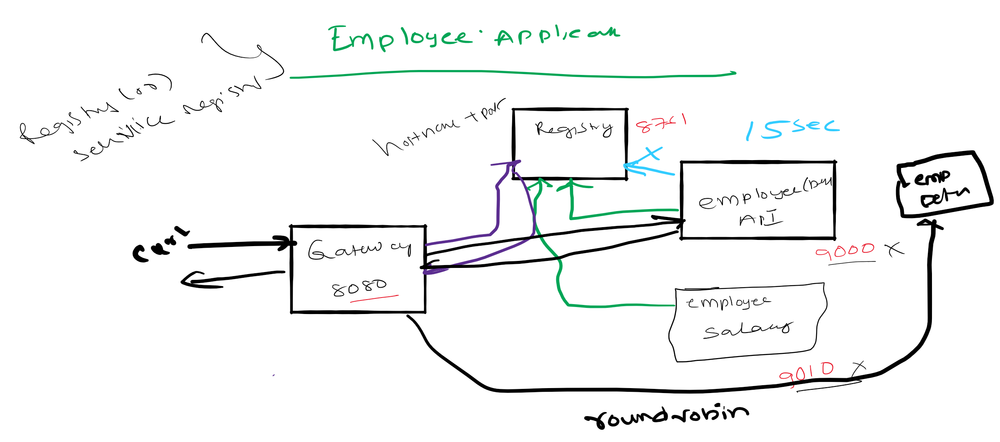

# Spring Cloud Session1 Microservices Introduction
In this tutorial we are going build three microservices and expose their service via gateway. User will
access the services via gateway. Two services (employee-api,payroll-api) is developed in Java and insurance-api is 
developed in Python. All the services are simple http REST apis.

Overview
- Run employee-api service on 9000. Where it takes employee id and returns employee name.
- Run payroll-api service on 9010. Where it takes employee id and returns employee salary.
- Run insurance-api service on 9020. Where it takes employee id and returns employee sum insured.
- Run Gateway service on 8080 and reverse proxy requests to all the services (employee-api,payroll-api,insurance-api)
- Spring Cloud load balancer (Client side load balancing) component in Spring Cloud Gateway acts as reverse proxy.
 
What is covered ?
- Develop restapi microservices in Java using springboot 
- Develop restapi microservices in Python using flask
- Develop ApiGateway micorservice in Java using Spring Cloud

# Source Code 
``` git clone https://github.com/balajich/spring-cloud-session-1-microservices-introduction.git ```
# Video
[](https://www.youtube.com/watch?v=8HQR6GdtI9o)
- https://youtu.be/8HQR6GdtI9o
# Architecture

# Prerequisite
- JDK 1.8 or above
- Apache Maven 3.6.3 or above
- Python 3.7.8 or above
# Clean and Build
- Java
    - ``` cd spring-cloud-session-1-microservices-introduction ``` 
    - ``` mvn clean install ```
- Python
    - ``` cd \spring-cloud-session-1-microservices-introduction\insurance-api ```
    - ```  pipenv install ``` 
 
 **Note: Maven is build and dependency tool for Java where as Pipenv is dependency tool for Python**
 
# Running components
- Employee API: ``` java -jar .\employee-api\target\employee-api-0.0.1-SNAPSHOT.jar ```
- Payroll API: ``` java -jar .\payroll-api\target\payroll-api-0.0.1-SNAPSHOT.jar ```
- Insurance API: 
    - ``` cd insurance-api ```
    - ```  pipenv run insurance_api.py ```
- Gateway: ```java -jar .\gateway\target\gateway-0.0.1-SNAPSHOT.jar ``` 

# Using curl to test environment
**Note I am running CURL on windows, if you have any issue. Please use postman client, its collection is available 
at spring-cloud-session-1-microservices-introduction.postman_collection.json**
- Access employee api directly: ``` curl -s -L  http://localhost:9000/employee/100 ```
- Access payroll api directly: ``` curl -s -L  http://localhost:9010/payroll/100 ```
- Access insurance api directly: ``` curl -s -L  http://localhost:9020/insurance/100 ```
- Access employee api via gateway: ``` curl -s -L  http://localhost:8080/employee/100 ```
- Access payroll api via gateway: ``` curl -s -L  http://localhost:8080/payroll/100 ```
- Access insurance api via gateway: ``` curl -s -L  http://localhost:8080/insurance/100 ```

**Note: Users will not access microservices (employee-api,payroll-api,insurance-api) directly. This will always access via gateway**
# Code
Employee API is a simple spring boot based rest-api. Snippet of **EmployeeController**
```java
 // Initialize database
    private static final Map<Integer, Employee> dataBase = new HashMap<>();
    static {
        dataBase.put(100, new Employee(100,"Alex"));
        dataBase.put(101, new Employee(101,"Tom"));
    }


    @RequestMapping(value = "/employee/{employeeId}", method = RequestMethod.GET)
    public Employee getEmployeeDetails(@PathVariable int employeeId) {
        logger.info(String.format("Getting Details of Employee with id %s",employeeId ));
        return dataBase.get(employeeId);
    }
```
Insurance API is a simple rest-api based on  Python Flask .  Snippet of **insurance_api.py**
```python
database = {100: {'id': 100, 'insurance': 10000}, 101: {'id': 101, 'insurance': 15000}}


class InsuranceController(Resource):
    def get(self, id):
        return database.get(id)


api.add_resource(InsuranceController, '/insurance/<int:id>')
```
Gateway is a Spring boot application which uses Spring Cloud Load Balancer for Client Side Load balancing. 
It is mainly configuration driven  **application.yml**  
```yaml
cloud:
    gateway:
      routes:
        - id: employee-api
          uri: http://localhost:9000
          predicates:
            - Path=/employee/**
        - id: payroll-api
          uri: http://localhost:9010
          predicates:
            - Path=/payroll/**
        - id: insurance-api
          uri: http://localhost:9020
          predicates:
            - Path=/insurance/**
```

# Next Steps
- Enhance existing application to run employee-api and payroll-api on dynamic ports.
- Ideally we will not care on which ports employee-api and payroll-api is running because we don't access the api directly, We always use gateway.
# References
- https://howtodoinjava.com/microservices/microservices-definition-principles-benefits/
- https://en.wikipedia.org/wiki/Microservices
# Next Tutorial
https://github.com/balajich/spring-cloud-microservices-hello-world-dynamic-ports